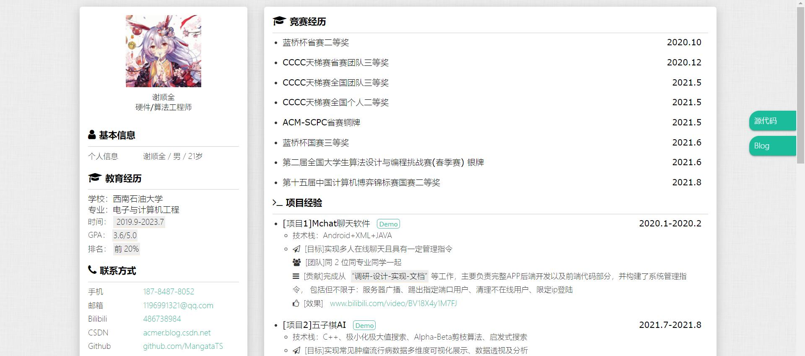
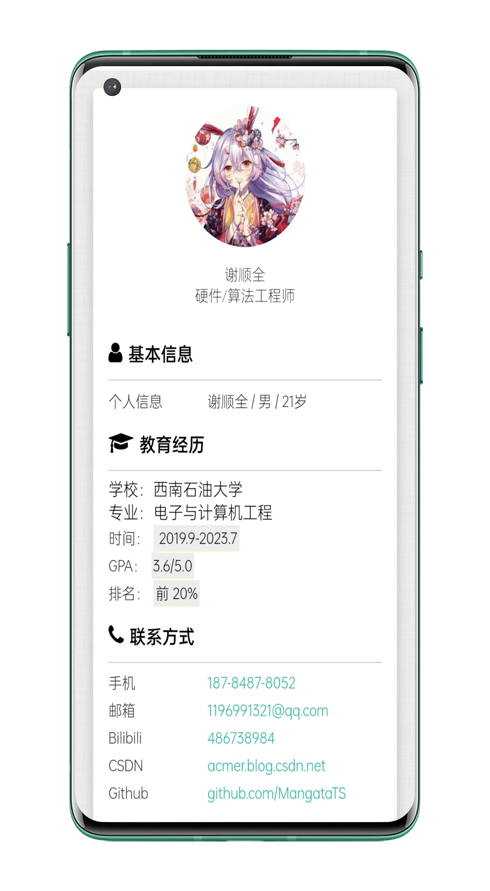

# 个人简历模板

[http://itsay.gitee.io/resume](http://itsay.gitee.io/resume)

欢迎使用（帮原作者打广告）
## Usage

1. 先Star/Fork本项目，然后Clone或者直接下载到本地
2. 修改index.html内相关信息
3. 微调样式（作为前端求职，这点应该不成问题）
4. 生成pdf(开发中)
5. 部署到线上
6. 生成访问二维码（开发中）
7. 祝您求职成功！

## Preview

### PC端

### 移动端

## TODO
- [x] 左栏固定（切换）
- [ ] 输出pdf功能
- [ ] 可编辑

